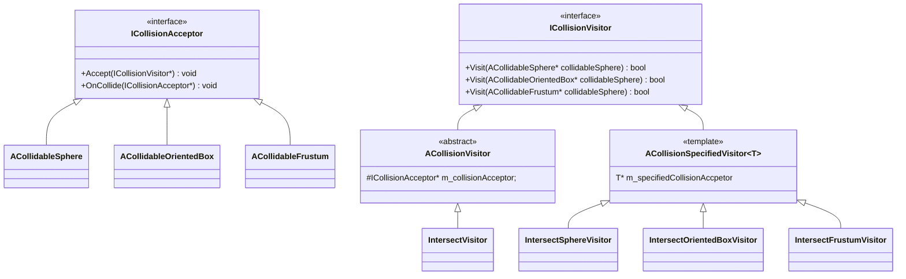
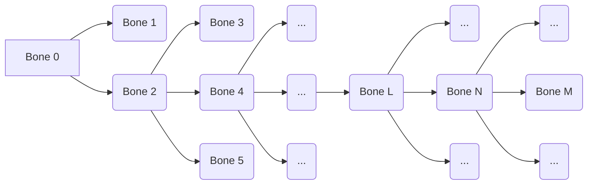
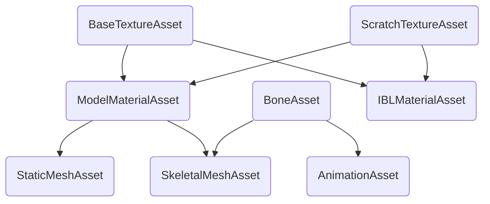
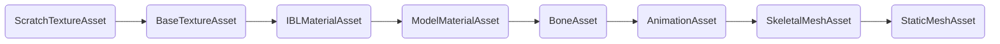


# DirectX11 Portfolio

본 포트폴리오는 **DirectX11** 기반의 엔진 프로그램을 개발하는 것을 목표로 한다.

## Features & Techniques
- 본 포트폴리오는 다음과 같은 주요 기능과 기술을 구현하였다.
	1. Collision(충돌 감지/처리)
	2. PBR(Physically Based Rendering)
	3. Deffered Shading
	4. Animation System
	5. Managing Asset & Component
	6. Lighting and Shadows (조명 및 그림자)
		- 현재 개발 중(Shadow Map 생성 기능까지 개발 완료)

## Details
### 1. Collision(충돌 감지 / 처리)

> [!IMPORTANT]
> 방문자 패턴 / Bounding Volume Hierachy(BVH) / Tree Rotation
 
본 포트폴리오는 충돌 판정을 위해 `DirectXCollision`을 활용하였으며, 이에 따라 충돌 감지 시스템을 설계하였다. 충돌 가능한 객체는`ICollisionAcceptor` 인터페이스를 상속 받아 구체화된다.


`AColldableSphere`는 `DirectX::BoundingSphere`를, `ACollidableOrientedBox`는 `DirectX::BoundingOrientedBox`를, `ACollidableFrustum`은 `DirectX::BoundingFrustum`을 상속 받아 충돌 판정을 수행하며, 특정 충돌이 발생하는 경우 `OnCollide(ICollisionAcceptor*)` 함수가 호출된다.
```cpp 
virtual void OnCollide(ICollisionAcceptor*) = 0;
```
이를 Override하여 각 충돌 객체는 충돌이 발생했을 때 적절한 처리를 수행할 수 있도록 확장할 수 있다.

`ICollisionVisitor` 클래스는 충돌 판정 로직 수행을 위한 인터페이스 클래스이며, `ACollisionVisitor`와 `ACollisionSpecifiedVisitor<T>`가 이를 상속 받는다. 이렇게 두 가지 클래스를 작성한 이유는 **방문자 패턴**을 활용하여  충돌하는 판정하는 두 대상을 Down-Casting 하기 위함이다. 
1. 충돌을 확인하기 위한 전체적인 함수 흐름
	```cpp
	ICollisionAcceptor* sphereCollisionComponent = ...;
	// class SphereCollisionComponent : public ACollidableSphere ...
	// class ACollidableSphere : public ICollisionAcceptor ...

	ICollisionAcceptor* orientedCollisionComponent = ...;
	// class OrientedBoxCollisionComponent: public ACollidableOrientedBox ...
	// class ACollidableOrientedBox : public ICollisionAcceptor ...

	IntersectVisitor intersectVisitor = IntersectVisitor(sphereCollisionComponent);
	// class IntersectVisitor : public ACollisionVisitor ...

	bool isIntersected = orientedCollisionComponent->Accept(&intersectVisitor);
	```
2. sphereCollisionComponent에 대한 Down-Casting 수행
	```cpp
	bool OrientedBoxCollisionComponent::Accept(ACollisionVisitor* collisionVisitor)
	{
		collisionVisitor->Visit(this);
		// orientedCollisionComponent는 가상함수 테이블을 토대로 다운캐스팅 될 수 있다.
	}
	```
3. orientedCollisionComponent에 대한 Down-Casting 수행
	```cpp
	bool IntersectVisitor::Visit(const ACollidableOrientedBox* const orientedCollisionComponent) const
	{
		IntersectOrientedBoxVisitor intersectOrientedBoxVisitor(orientedCollisionComponent);
		// 다운캐스팅된 ACollidableOrientedBox* orientedCollisionComponent를 intersectOrientedBoxVisitor에 인자로 넘겨 멤버변수로 관리하도록 한다.
		return m_collisionAcceptor->Accept(intersectOrientedBoxVisitor);
		// IntersectOrientedBoxVisitor를 통하여 sphereCollisionComponent를 orientedCollisionComponent와 동일한 방식으로 다운캐스팅한다.
	}
	```
위 흐름을 통하여 업캐스팅된 상태로 관리되는 두 객체 간 충돌 여부를 자동으로 가상 함수 테이블을 활용하여 다운 캐스팅하여 확인 할 수 있다. 

마지막으로 본 포트폴리오는 충돌 여부를 효과적으로 수행하기 위하여 공간 데이터를 이진트리로 관리하는 자료 구조인 **Bounding Volume Hierachy(BVH)** 를 지원한다.

[](https://youtu.be/WXstLyR29fg)


위 동영상은 BVH를 시각적으로 표현한 동영상이며, `BVH_FrustumCulling` 브랜치를 통하여 확인할 수 있다.
Bounding Volume Hierachy는 내부에서 ICollisionAcceptor를 관리하며, 이를 순회하여 충돌 여부를 이진 트리 탐색을 통하여 수행한다. 이를 Frustum Culling, Shadow Map 생성 등에 활용할 수 있다. 탐색은 $O(N)$ ~ $O(logN)$의 시간 복잡도를 가진다. 여기서 Bounding Volume 간 계층적 구조가 불균형한 경우(Sorted Input  Incremental 등) 최악의 상황이 발생할 수 있다. 따라서 이를 방지하기 위하여 Volume에 대한 크기를 최소화하는 방향으로 부모들을 재구성하는 **Tree Rotation** 기능을 포함하였다.

### 2. PBR(Physically Based Rendering)

> [!IMPORTANT]
> PBR, BRDF, Microfacet Theory, IBL

물체의 특정 위치가 빛과 상호작용하는 물리학적 모델을 구축하고, 이를 통해 렌더링을 수행하여 **PBR(Physically Based Rendering)** 을 수행한다.

점 $P$가 $\vec v$방향으로 반사하는 빛은 다음과 같이 표현할 수 있다.
```math 
L_{o}(P, \vec v)$ = $\int_{\Omega}f(\vec l, \vec v) L_{i}(P, \vec l) \vec n \cdot \vec l d\Omega
```

위 식의 의미 다음과 같다.
- $f(\vec l, \vec v)$ =  광원의 위치벡터 $\vec l$ 로 부터 들어오는 빛이 시점의 위치벡터 $\vec v$로 반사되는 관계를 나타내는 방정식
- $L_{i}(P, \vec l)$ = 점 $P$로  광원의 위치벡터 $\vec l$방향으로 부터 들어오는 빛
- $\vec n \cdot \vec l$ = 점 $P$의 Normal 벡터 $\vec n$과  $\vec l$의 내적

위 결과를 [Physically-Based Shading Models in Film and Game Production SIGGRAPH 2010 Course Notes](https://renderwonk.com/publications/s2010-shading-course/hoffman/s2010_physically_based_shading_hoffman_a_notes.pdf) 에서는 다음과 같이 표현한다.
> Although this equation may seem a bit daunting, its meaning is straightforward: outgoing radiance equals the integral (over all directions above the surface) of incoming radiance times the BRDF and a cosine factor.

**BRDF(Bidirectional reflectance distribution function)** 는 명칭에서 알 수 있듯 두가지 방향에 대해 종속성을 가지는 함수이다. $f(\vec l, \vec v)$ 항을 BRDF 라고 부르며, 물리적인 특성에  표면 반사(surface reflection, Specular Term), 아래층 산란(subsurface scattering, Diffuse Term)으로 구분된다.  

지역 조명에 대한 BRDF를 아래와 같이 표현할 수 있다.

1. Diffuse Term
대부분 Diffuse Term은 **Lambertian BRDF**를 채택하여 기술한다. 이는 아래와 같이 표현된다. 이때 상수 $c_{diff}$는, $c_{spec}$와 같이 RGB 벡터이다.

```math
f_{Lambertian}(\vec l, \vec v) = \frac{c_{diff}}{\pi}
```

2. Specular  BRDF Term
대부분 Specular Term은 **Microfacet Theory**를 채택하여 기술한다. 물체는 무수한 미세면들로 이루어져 있고, 이 미세면들에 의해 빛은 상호작용 한다. 우리는 이 미세면 중 BRDF 함수의 정의에 따라 $\vec l$ 에서  빛이 들어올 때 $\vec v$로 반사되는 미세면에 대해서만 관심이 있다. 이 미세면을 Active Microfacet이라고 하며, 이때 이 미세면의 법선 방향 벡터는 $\vec h$(half-way vector)로 표현될 수 있다.
최종적으로 표면 반사에 대한 BRDF는 다음과 같이 표현된다.

```math
f(\vec l, \vec v)_{specualr} = \frac{F(\vec l, \vec h) G(\vec l, \vec v, \vec h) D(\vec h)}{4(\vec n \cdot \vec l)(\vec n \cdot \vec v)}
```

 - $F(\vec l, \vec h)$, 프레넬 반사항(Fresnel Reflectance Term)
	 - 프레넬 반사항은 광학적으로 물체에 빛이 입사되었을 때 반사하는 빛의 비율 나타내는 항이다. 이는 물체의 고유 특성인 굴절률과 입사각에 따라 달라진다.
	 - 프레넬 반사항은 복잡한 비선형적 형태를 띄고 있어 모사하기에 복잡한 어려움이 있다. 하지만 주요 특징으로 입사각이 $0^{o}$ ~  $45^{o}$일 경우 상수($c_{spec})$에 가깝고, 이후 급격하게 RGB 벡터가 1로 수렴한다는 점이다.
	 - 이에 따라 Schilick은 프레넬 반사항에 대한 방정식을 모사할 수 있는 아래 식을 제안하였다.

```math
F_{Schlick}(c_{spec}, \vec l, \vec h) = c_{spec} + (1 - c_{spec}) ( 1 - \vec l \cdot \vec h)^{5}
```

 - $G(\vec l, \vec v, \vec h)$, 기하 감쇠 항(Geometry Term)
	 - 기하 감쇠항은 미세면이 $\vec l$과 $\vec v$에 대해서 동시에 보일 확률을 나타내는 확률 밀도 함수이다. 따라서 정규분포항과 다르게 0 ~ 1 사이의 스칼라이다.
	 - 포트폴리오에는 Roughness를 $\alpha$ 항으로 받는 Schlick Geometry Function을 채택하며, 이는 아래와 같다. 이때 $\vec n$는 거시표면의 법선이다.

```math
G_{Schlick​}(\vec l, \vec v) = G_{Schlick}(\vec l)G_{Schlick}(\vec v)
```
```math
k = \alpha / 2
```
```math
G_{Schlick​}(\vec x) = \frac{\vec x \cdot \vec n}{(\vec x \cdot \vec n)( 1 - k) + k}
```

 - $D(\vec h)$, 정규분포항(Normal Distribution Term)
	 - 정규분포항은 미세면의 법선 분포 밀도 함수이며, 미세면의 법선이 균동 분포할 경우에 대비하여 얼마나 집중되어 있는지를 의미하지, 확률 밀도 함수가 아니다. 따라서 값은 스칼라이고 음수가 아니며 1보다 클 수도 있다.
	 - Active Microfacet에 대한 법선 분포 밀도가 어떻게 구성되어 있는지 알기 위해, 미세면의 법선이 $\vec h$인 경우에 대한 식으로 표현할 수 있으며, GGX, Beckmann 등 다양한 모델이 있다.
	 - 포트폴리오에서는 Roughness를 $\alpha$ 항으로 받는 GGX를 정규분포항으로 채택하며, 이는 아래와 같다. 이때 $\vec n$는 거시표면의 법선이다.

```math
D_{GGX}(\vec h) = \frac{\alpha^{2}}{\pi ((\vec n \cdot \vec h)^{2}(\alpha^{2} - 1)+ 1)^{2}}
```

따라서 N개의 지역 조명은 아래와 같이 계산할 수 있다. 이때 $L_{i}(P)$ 는 점 P에 대한 $i$ 번째 조명의 세기이다.

$$L_{o}(P, \vec v) \approx  \sum_{i = 1}^{N} (\frac{c_{diff}}{\pi} + \frac{F(\vec l_{i}, \vec h_{i}) G(\vec l_{i}, \vec v, \vec h_{i}) D(\vec h_{i})}{4(\vec n \cdot \vec l_{i})(\vec n \cdot \vec v_{i})} ) L_{i}(P) (\vec n \cdot \vec l_{i})  $$

전역 조명의 경우, **IBL(Image-Based Lighting)** 를 통하여 빛의 반사 상호작용을 기술한다. 환경에 대한 빛의 처리는 Monte-Carlo 샘플링을 활용하여 아래와 같은 수식을 통하여 처리할 수 있다.

```math
L_{o}(P, \vec v) = \int_{\Omega} \frac{f(\vec l, \vec v) L_{i}(P, \vec l) (\vec n \cdot \vec l) }{p(\vec l, \vec v)}p(\vec l, \vec v)  d\Omega \approx \frac{1}{N} \sum_{i = 1}^{N} \frac{f(\vec l, \vec v) L_{i}(P, \vec l) \vec n \cdot \vec l}{p(\vec l_{i}, \vec v)}
```

이때 $p(\vec l, \vec v)$는 중요도 샘플링을 위한 확률 밀도 함수이다. Diffuse에 대한 중요도 샘플링에는 Cosine-weighted Sampling($p_{cos-weighted}(\vec l, \vec v) = \frac{\vec l \cdot \vec n}{\pi}$)이 주로 사용되고,  Specular에 대한 중요도 샘플링에는 GGX Importance Sampling($p_{GGX-importance}(\vec l, \vec v) = \frac{D(\vec h)(\vec h \cdot \vec n)}{4(\vec h \cdot \vec v)}$)가 주로 사용된다.

실시간으로 이에 대한 샘플링을 수행하고 계산하는 것이 비효율적이다. 따라서 사전 계산된 Texture와 **LUT (Look-Up Table)** 을 활용하여 성능을 최적화 한다. 'IBLBaker'와 같은 프로그램을 통해 IBL에 사용하기 위한 데이터를 사전에 계산하여 생성할 수 있다.

> 위 프로그램은 IBLBaker로, 좌측을 보면 Environment에 따른 BRDF LUT와  Specular IBL, Irradiance IBL 텍스쳐를 생성할 수 사전에 샘플링하여 계산할 수 있다.

샘플링을 통해 텍스쳐를 생성하고 이를 활용하기 위해, Monte-Carlo 샘플링을 통한 환경에 대한 빛의 처리식을 두 개로 분리할 수 있다.

```math
L_{o}(P, \vec v)  \approx \frac{1}{N} \sum_{i = 1}^{N} \frac{f(\vec l, \vec v) L_{i}(P, \vec l) \vec n \cdot \vec l}{p(\vec l_{i}, \vec v)} = (\frac{1}{N}\sum_{i = 1}^{N} L_{i}(P, \vec l))(\frac{1}{N} \sum_{i = 1}^{N} \frac{f(\vec l, \vec v) \vec n \cdot \vec l}{p(\vec l_{i}, \vec v)})
```

빛에 대한 상호작용을 각 Diffuse, Specular로 분리하여 대해 정리해보자.
```math
L_{o_{diffuse}}(P, \vec v) \approx (\frac{1}{N}\sum_{i = 1}^{N} L_{i}(P, \vec l))(\frac{1}{N} \sum_{i = 1}^{N} \frac{f(\vec l, \vec v) \vec n \cdot \vec l}{p(\vec l_{i}, \vec v)})
```
여기서 좌항은 Irradiance IBL 텍스쳐로 생성하여 단순한 샘플링을 통해 계산될 수 있다. 우항은 $p(\vec l_{i}, \vec v)$ = $p_{cos-weighted}(\vec l, \vec v) = \frac{\vec l \cdot \vec n}{\pi}$ 이고, 앞서 살펴본 Lambertian BRDF($\frac{c_{diff}}{\pi}$)를 통해 정리될 수 있다. 최종적인 식은 아래와 같다.

```math
L_{o_{diffuse}}(P, \vec v)  \approx  (\frac{1}{N}\sum_{i = 1}^{N} L_{i}(P, \vec l))(\frac{1}{N} \sum_{i = 1}^{N} \frac{f(\vec l, \vec v) \vec n \cdot \vec l}{p(\vec l_{i}, \vec v)}) = (Sample_{IBL_{diff}})(c_{diff})
```
	
2. Specular Term
```math
L_{o_{specular}}(P, \vec v) \approx (\frac{1}{N}\sum_{i = 1}^{N} L_{i}(P, \vec l))(\frac{1}{N} \sum_{i = 1}^{N} \frac{f(\vec l, \vec v) \vec n \cdot \vec l}{p(\vec l_{i}, \vec v)})
```
여기서 좌항은 specular IBL 텍스쳐로 생성하여 단순한 샘플링을 통해 계산될 수 있다. 우항은 $\gamma = ( 1 - \vec l \cdot \vec h)^{5})$ 일 때, 다음과 같이 정리될 수 있다.

```math
\frac{1}{N} \sum_{i = 1}^{N} \frac{f(\vec l, \vec v) \vec n \cdot \vec l}{p(\vec l_{i}, \vec v)} =\frac{1}{N} \sum_{i = 1}^{N} \frac{f(\vec l, \vec v) \vec n \cdot \vec l }{p(\vec l_{i}, \vec v) F_{Schlick}(\vec l, \vec h)}F_{Schlick}(\vec l, \vec h)
```
```math
=\frac{1}{N} \sum_{i = 1}^{N} \frac{f(\vec l, \vec v) \vec n \cdot \vec l }{p(\vec l_{i}, \vec v) F_{Schlick}(\vec l, \vec h)}( c_{spec} + (1 - c_{spec}) ( 1 - \vec l \cdot \vec h)^{5})
```
```math
=\frac{1}{N} \sum_{i = 1}^{N} \frac{f(\vec l, \vec v) \vec n \cdot \vec l }{p(\vec l_{i}, \vec v) F_{Schlick}(\vec l, \vec h)}( c_{spec} + (1 - c_{spec}) \gamma)
```
```math
=\frac{1}{N} \sum_{i = 1}^{N} \frac{f(\vec l, \vec v) \vec n \cdot \vec l }{p(\vec l_{i}, \vec v) F_{Schlick}(\vec l, \vec h)}((1 - \gamma)c_{spec} +  \gamma)
```
```math
=\frac{1}{N} \sum_{i = 1}^{N} \frac{f(\vec l, \vec v) \vec n \cdot \vec l }{p(\vec l_{i}, \vec v) F_{Schlick}(\vec l, \vec h)}(1 - \gamma)c_{spec} + \frac{1}{N} \sum_{i = 1}^{N} \frac{f(\vec l, \vec v) \vec n \cdot \vec l }{p(\vec l_{i}, \vec v) F_{Schlick}(\vec l, \vec h)}\gamma
```

이를 통해서 우항을  $c_{spec}$에 대한 선형식($ac_{spec} + b$)으로 표현할 수 있다. 이때 a와 b에 대한 값을 ($\vec h \cdot \vec v$, roughness)로 샘플링 할 수 있게 BRDF LUT를 생성할 수 있다. 따라서 최종적인 식은 다음과 같다.
$L_{o_{diffuse}}(P, \vec v)  \approx  (\frac{1}{N}\sum_{i = 1}^{N} L_{i}(P, \vec l))(\frac{1}{N} \sum_{i = 1}^{N} \frac{f(\vec l, \vec v) \vec n \cdot \vec l}{p(\vec l_{i}, \vec v)}) = (Sample_{IBL_{spec}})(Sample_{LUT_{\vec h \cdot \vec v}} c_{spec} + Sample_{LUT_{roughness}})$


### 3. Deferred Shading

> [!IMPORTANT]
> GBuffer, MRT

각 Component를 어떻게 그릴지에 대한 함수는 Component에 대한 Visitor 인터페이스 클래스` IComponentVisitor`를 상속 받아서 구현한다. 포트폴리오에는 Forward Shading을 위한  `SceneForwardRenderer`와 Deferred Shading을 위한 `SceneDeferredRenderer`를 통해서 `IComponentVisitor` 내부 각 Component에 대한 함수를 오버라이딩하여 구현한다.
[](https://youtu.be/c-_aR995ip4)

Renderer를 선택하면 `SceneForwardRenderer`와 `SceneDeferredRenderer`를 선택할 수 있고, 선택한 렌더링 기법을 활용하여 렌더링이 시작된다.
`SceneDeferredRenderer` 선택 시, Viewport 상단에 Deferred Shading을 위한 GBuffer가 디버깅 목적으로 그려지는 것을 확인할 수 있다.
GBuffer는 다음과 같이 구성하였다.
1. Position
2. Specular Color
3. Diffuse Color
4. AO(x) / Metallic(y) / Roughness(z)
5. Nomal Vector
6. Emissive Color
7. Fresnel Reflectance

Component 당 Draw 콜이 있을 때, GBuffer에 해당하는 **MRT(Multiple Render Targets)** 에 각 데이터를 입력하고, 마지막으로 GBuffer들을 Shader Resource View로 활용하여 렌더링을 수행한다. 

### 3. Animation System

> [!IMPORTANT]
> Bone Offset Matrix / Animation Retargeting

본 포트폴리오는 애니메이션 시스템을 지원한다. `.fbx`와 같은 파일을 바탕으로 애니메이션 파일을 불러오고, 키에 대한 변환을 시간에 대하여 `AnimationAsset` 형태로 저장, 관리한다. `AnimationAsset` 은 `BoneAsset`과 연관되어 있다. `AnimationAsset`의 채널 명은 `BoneAsset`의 뼈 이름이 동일하다. 이를 통하여 시간에 대한 특정 뼈의 애니메이션의 변환행렬과, 뼈의 Offset Matrix을 확인할 수 있다.  이를 조합하여 애니메이션을 수행한다.

**Bone Offset Matrix**는 Skinned Mesh의 정점을 해당 Bone-Space(뼈의 로컬 좌표계)로 변환하는 행렬이다. 즉 해당 뼈대의 Bind-Pose를 위한 변환행렬은 Bone Offset Matrix의 역행렬이다. 또는 Bone Offset Matrix는 Bind-Pose로부터 Root로 변환되는 To-Root 행렬로 볼 수 있다.

```math
M_{0_{bind}} = M_{0_{offset}}^{-1}
```

위 성질을 바탕으로, A BoneAsset과 연관된 A AnimationAsset을 B BoneAsset에 연관된 AnimationAsset으로 변환할 수 있다. 


위와 같이 뼈대가 구성되어 있다고 가정하자.

Bone 0과 Bone 2에 대하여  $M_{0_{bind}} = M_{0_{offset}}^{-1}$, $M_{2_{bind}} = M_{2_{offset}}^{-1}$이므로 Bone 0의 Bind Pose에서 Bone 2의 Bind Pose으로 변환하는 변환을 $M_{Feed_{0}}$라고 할 때,  $M_{2_{bind}} = M_{Feed_{0}}M_{0_{bind}}$ 이다. 
```math
M_{Feed_{0}} = M_{2_{bind}}M_{0_{bind}}^{-1} = M_{2_{offset}}^{-1}M_{0_{offset}}
```
Bone 2와 Bone 4에 대하여 Bone 2의 Bind Pose에서 Bone 4의 Bind Pose으로 변환하는 변환을 $M_{Feed_{2}}$라고 할 때,  $M_{4_{bind}} = M_{Feed_{2}}M_{2_{bind}}$ 이다. 
```math
M_{Feed_{2}} = M_{4_{bind}}M_{2_{bind}}^{-1} = M_{4_{offset}}^{-1}M_{2_{offset}}
```
Bone M과 이의 자식 Bone N에 대하여 위 과정을 반복할 경우,
```math
M_{Feed_{N}} = M_{N_{bind}}M_{M_{bind}}^{-1} = M_{N_{offset}}^{-1}M_{M_{offset}}
```
으로 표현할 수 있다. 

이를 통하여 BoneAsset A와 BoneAsset B의 특정 Bone이 연관되어 있다고 할 때, BoneAsset A의 Bone N과 이의 자식 Bone M간의 관계와 BoneAsset B의 Bone N'과 이의 자식 Bone M' 간의 관계를 아래와 같이 표현 할 수 있다.
```math
M_{A_{Feed_{N}}}  = M_{A_{M_{offset}}}^{-1}M_{A_{N_{offset}}}
M_{B_{Feed_{N'}}}  = M_{B_{M'_{offset}}}^{-1}M_{B_{N'_{offset}}}
```

애니메이션 데이터는 각 채널의 로컬 좌표계에 대한 변환행렬로 구성되어 있다. A AnimationAsset의 채널 N에 대한 변환행렬이 $M_{A_{channel_{N}}}$이라고 할 때,
B AnimationAsset의 채널 N'에 대한 변환행렬 $M_{B_{channel_{N'}}}$는  $M_{A_{channel_{N}}}$에 $M_{A_{Feed_{N}}}$와 $M_{B_{Feed_{N'}}}$를 보상 받는 방법으로 구할 수 있다.
```math
M_{B_{channel_{N'}}} = M_{B_{Feed_{N'}}}M_{A_{Feed_{N}}}^{-1}M_{A_{channel_{N}}}
```

위에서 전개한 수식을 활용하여 Animation Retargeting을 수행하여 하나의 애니메이션 데이터를 여러 뻐대에 활용 할 수 있다.

[](https://youtu.be/HzTLELvzFiY)

### 4. Managing Asset & Component

> [!IMPORTANT]
> 위상정렬 / Database / ERD(Entity Relation Diagram) / 더블 버퍼링

본 포트폴리오에서 관리하는 데이터는 크게 2개로 나눌 수 있다. Asset과 Component이다.
Asset은 게임 제작에 사용되는 여러가지 데이터를 의미한다. `.fbx`를 통해 얻을 수 있는 뼈대, 매시, 애니메이션이나, `.png` 등을 통해 얻을 수 있는 텍스쳐 등이 Serialize를 통해 Asset 으로 저장되어 관리되며, 이를 Deserialize로 불러와서 활용할 수 있다.

특정 Asset은 특정 Asset에 대한 종속성을 가질 수 있다. 예를 들면 `ModelMaterialAsset`은 모델을 렌더링하기 위한 재질 Asset으로, `BaseTextureAsset`에 종속되어있다. 따라서 프로그램 초기화 시, 파일 형태로 저장된 Asset을 Deserialize 하는 순서가 종속성을 바탕으로 지정 되어야 한다.
> ModelMaterialAsset은 BaseTextureAsset에 종속되어 있는데, BaseTextureAsset이 Deserialize 되기 전에 ModelMaterialAsset이 Deserialize 되면 null pointer에 접근할 수 있다.

이 문제를 해결하기 위하여 **위상정렬**을 활용하였다.
```cpp
AssetReader::AssetReader(const string& assetBasePath)
	: m_assetBasePath(assetBasePath)
{
	m_topologySorter.AddTopologyNode(EAssetType::ASSET_TYPE_STATIC);
	m_topologySorter.AddTopologyNode(EAssetType::ASSET_TYPE_SKELETAL);
	m_topologySorter.AddTopologyNode(EAssetType::ASSET_TYPE_BONE);
	m_topologySorter.AddTopologyNode(EAssetType::ASSET_TYPE_ANIMATION);
	m_topologySorter.AddTopologyNode(EAssetType::ASSET_TYPE_BASE_TEXTURE);
	m_topologySorter.AddTopologyNode(EAssetType::ASSET_TYPE_SCRATCH_TEXTURE);
	m_topologySorter.AddTopologyNode(EAssetType::ASSET_TYPE_MODEL_MATERIAL);
	m_topologySorter.AddTopologyNode(EAssetType::ASSET_TYPE_IBL_MATERIAL);

	m_topologySorter.AddPrequisite(EAssetType::ASSET_TYPE_STATIC, EAssetType::ASSET_TYPE_MODEL_MATERIAL);
	m_topologySorter.AddPrequisite(EAssetType::ASSET_TYPE_SKELETAL, EAssetType::ASSET_TYPE_MODEL_MATERIAL);
	m_topologySorter.AddPrequisite(EAssetType::ASSET_TYPE_SKELETAL, EAssetType::ASSET_TYPE_BONE);
	m_topologySorter.AddPrequisite(EAssetType::ASSET_TYPE_ANIMATION, EAssetType::ASSET_TYPE_BONE);
	m_topologySorter.AddPrequisite(EAssetType::ASSET_TYPE_MODEL_MATERIAL, EAssetType::ASSET_TYPE_BASE_TEXTURE);
	m_topologySorter.AddPrequisite(EAssetType::ASSET_TYPE_MODEL_MATERIAL, EAssetType::ASSET_TYPE_SCRATCH_TEXTURE);
	m_topologySorter.AddPrequisite(EAssetType::ASSET_TYPE_IBL_MATERIAL, EAssetType::ASSET_TYPE_BASE_TEXTURE);
	m_topologySorter.AddPrequisite(EAssetType::ASSET_TYPE_IBL_MATERIAL, EAssetType::ASSET_TYPE_SCRATCH_TEXTURE);
...
}
```
위와 같이 Asset 간의 종속관계를 지정하여 주고, 해당 종속 관계를 바탕으로 그래프를 생성하면 다음과 같은 그래프를 확인할 수 있다. 

이 그래프를 노트 입력 순서대로 후위 순회하고 이를 역순으로 정렬하면 다음과 같은 순서가 된다.

 이 결과를 바탕으로 Asset을 Deserialize하면 위 문제를 해결할 수 있다.

Component는 Asset나 사용자가 정의한 데이터를  하나의 틀로 만든 데이터이다. 예를 들어 `SkeletalMeshAsset`과 여러 `ModelMaterialAsset` 를 멤버 변수로 가지는 `SkeletalMeshComponent`가 있다. `AComponent` 추상 클래스를 상속받아 필요한 객체를 정의하고, 이를 엔진에서 관리할 수 있다. Component에 대한 데이터는 **Database**를 통해 저장된다.  DB에서 Component를 관리하기 위한 **ERD(Entity Relation Diagram)** 은 `ApplicationBase` 프로젝트 내에 있는 `ComponentDBModels.mwb` 파일을 통해 MySQL 워크벤치를 통해 확인할 수 있다.
> Component에 대한 데이터를 Database에 저장하는 이유는, 추후 클라이언트 프로그램, 서버 프로그램과 연동시, 데이터 동기화를 수행하기 위함이다.


`ComponentManager` 클래스는 매 프레임마다 변경사항이 존재하는 `AComponent`에 대한 로컬 변수 업데이트를 수행한다. 추가적으로 업데이트를 수행한 객체를 별도 관리하고 이들을 별도의 스레드에서  특정 주기(1초)마다 Transaction으로 묶어 Database에 업데이트한다. 이때 동시성 문제가 발생할 수 있으므로 **더블 버퍼링**을 활용하였다.

```cpp
// 더블 버퍼링을 위한 멤버 변수

std::shared_mutex m_updateSetMutex;
std::set<AComponent*> m_updateToDBComponentsMain;
// 메인 스레드를 통해서 매 프레임마다 변경사항이 존재하는 AComponent의 포인터를
// 저장하는 std::set 컨테이너  
std::set<AComponent*> m_updateToDBComponentsWorker;
// 작업자 스레드를 통해서 특정 주기(1초) 마다 Database에 업데이트를 수행할 
// AComponent의 포인터를 저장하는 std::set 컨테이너
```
메인 스레드는 `m_updateToDBComponentsMain` 에 변경사항이 존재하는 AComponent의 포인터를 삽입하고, Database에 업데이트를 수행하는 작업자 스레드는 특정 주기(1초)마다 `m_updateToDBComponentsMain`를 `m_updateToDBComponentsWorker`로 복사하고 `m_updateToDBComponentsWorker`를 활용한다. 만약 Transaction이 실패할 경우, `m_updateToDBComponentsWorker`의 원소를 다시 `m_updateToDBComponentsMain`에 삽입한다.

### 5. Lighting And Shadow(개발 진행 중)

